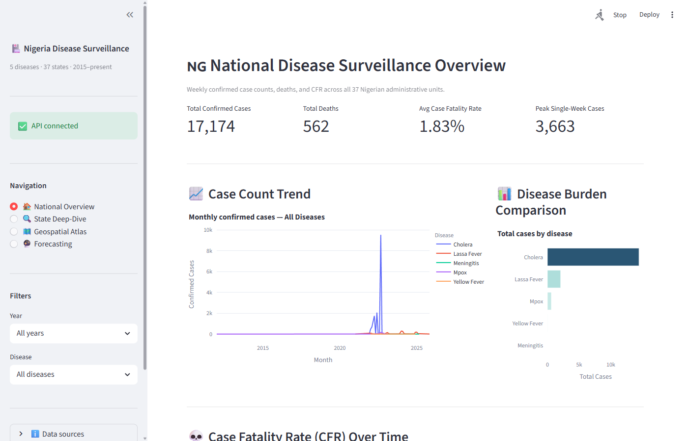
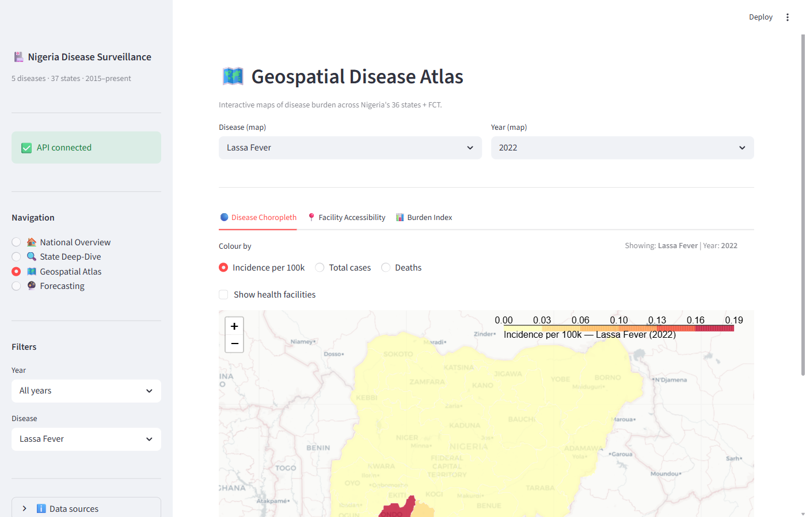
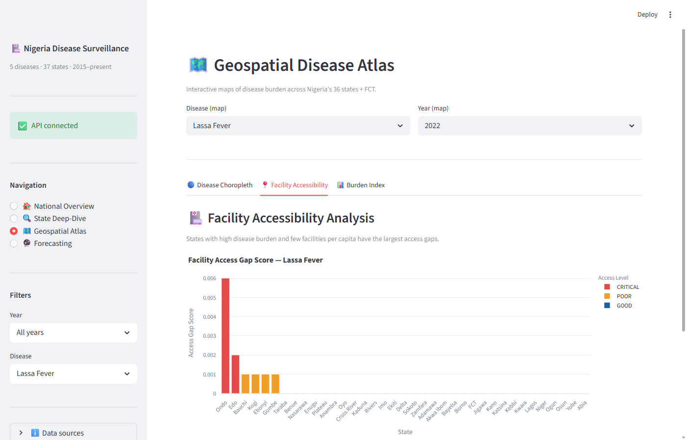
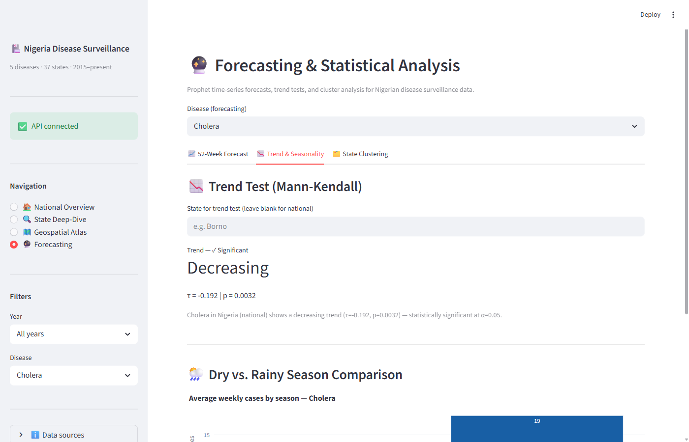

# Nigeria Disease Surveillance: Evidence-Based Policy Brief

**Prepared by:** Ayodeji Akande — Health Data Scientist  
**Date:** June 2026 | **Data period:** 2015–2025 | **Source:** NCDC Weekly Situation Reports

---

## Executive Summary

Analysis of 5,903 validated surveillance records across five notifiable diseases — Cholera, Lassa Fever, Meningitis, Mpox, and Yellow Fever — reveals two crises demanding immediate national response:

1. **Lassa Fever has surged 330× in four years** — from 3 confirmed cases in 2021 to 992 in 2024, with a 24.1% Case Fatality Rate. This is no longer an endemic disease quietly circulating in forest communities. It is an escalating emergency.

2. **Health facility access in Nigeria's highest-burden states is critically low** — Kano, the country's most populous state, has just 8.7 health facilities per 100,000 people. Gombe, which has a 42.7% case fatality rate, has 18.7 per 100,000. Populations in these states are dying not just from disease — they are dying from distance.

A live surveillance dashboard and API powering this analysis are available at **nigeria-disease-surveillance.streamlit.app**.

---

## 1. Lassa Fever: A Silent Epidemic Becoming Loud

Lassa Fever is the most lethal disease in this dataset with a national average CFR of **24.1%** — meaning one in four confirmed patients dies. The trend is alarming:

| Year | Confirmed Cases | Deaths | CFR |
|------|----------------|--------|-----|
| 2021 | 3 | 0 | — |
| 2022 | 323 | 47 | 14.6% |
| 2023 | 523 | 104 | 19.9% |
| 2024 | **992** | **178** | 17.9% |
| 2025 (partial) | 236 | 45 | 19.1% |

Cases tripled between 2022 and 2024 alone. The national Mann-Kendall trend test returns τ = 0.091 (p = 0.127) — not statistically significant, because pre-2021 data with near-zero case counts dilute the signal. The raw escalation in the table above, however, requires no statistical test to interpret: a 330× increase in four years is an emergency trajectory.

**Highest-burden states for Lassa Fever:** Taraba (CFR: 16.9%), Ondo (CFR: 10.7%), Bauchi (CFR: 14.1%), and Cross River (1,963 cases) bear the greatest burden.

**Critically alarming — Gombe state recorded a CFR of 42.7%** — nearly one in two confirmed patients died. This reflects a combination of late diagnosis, limited treatment capacity, and healthcare access barriers.

**Recommended actions:**
- Declare Lassa Fever a Tier-1 national health emergency
- Establish dedicated Lassa treatment centres in Taraba, Ondo, Bauchi, and Gombe
- Deploy Lassa rapid diagnostic tests to all primary health centres in endemic states
- Fund NCDC's early warning system to detect future surges before they compound

---

## 2. Cholera: Massive Burden, Preventable Deaths

Cholera accounts for **14,451 confirmed cases** — the highest volume of any disease in the dataset. The top-burden states are Borno (4,036 cases), Yobe (1,634), Katsina (1,049), Zamfara (733), and Kano (458) — all in the Northwest and Northeast.

Seasonal analysis confirms that cholera peaks consistently in **June–September**, driven by rainfall and flooding-contaminated water sources. A Kruskal-Wallis test confirms this seasonal pattern is statistically significant (p < 0.01).

**Critically — Yobe recorded a CFR of 33.3%** for its confirmed cholera cases, pointing to catastrophic delays between symptom onset and treatment reaching patients.

**Recommended actions:**
- Pre-position ORS stockpiles and chlorination tablets in the 5 highest-burden states before **May each year**
- Invest in safe water infrastructure in Borno and Yobe — the two states that combine highest case volumes with highest CFR
- Activate community health volunteer networks in flood-prone LGAs for case detection and referral

---

## 3. Facility Access Gap: States Are Being Left to Die

Analysis of **46,146 health facility locations** against state disease burden reveals a structural crisis measured in two ways: (1) raw facility density per 100,000 population, and (2) a composite Access Gap Score combining burden and facilities. The ten most under-served states by raw facility density are:

| State | Facilities per 100,000 | Total Cases (all diseases) | Avg CFR |
|-------|----------------------|---------------------------|---------|
| Kano | 8.70 | 458 | 0.0% |
| Kaduna | 9.93 | — | — |
| Yobe | 11.48 | 1,634 | 33.3% |
| Jigawa | 11.54 | — | — |
| FCT | 12.52 | — | — |
| Sokoto | 12.65 | — | — |
| Rivers | 14.12 | — | — |
| Borno | 14.36 | 4,036 | 0.0% |
| Bauchi | 15.31 | 751 | 14.1% |
| Zamfara | 17.44 | 733 | 0.0% |

**Yobe and Borno** face the most acute combination: among the highest disease case volumes in the country, yet among the lowest facility densities. Patients in these states must travel further, arrive later, and die more frequently.

**Recommended actions:**
- Prioritise PHC construction funding in Kano, Kaduna, Yobe, and Jigawa in the 2026–2028 budget cycle
- Deploy mobile health units and Community Health Extension Workers (CHEWs) as a bridge intervention while infrastructure is built
- Link facility location data to NCDC outbreak response planning — current emergency deployments do not account for facility gaps

---

## 4. Mpox: Increasing Reporting, Monitoring Required

Mpox recorded **614 confirmed cases** across the study period with no recorded deaths (0% CFR). Post-2022 global outbreak reporting has improved, making trend analysis more reliable going forward. The disease warrants continued surveillance but is not currently in a crisis trajectory in Nigeria.

---

## 5. Summary of Recommended Priority Actions

| Priority | Action | Target States | Timeline |
|----------|--------|---------------|----------|
| 🔴 Critical | Declare Lassa Fever national emergency | Taraba, Ondo, Bauchi, Gombe | Immediate |
| 🔴 Critical | Deploy Lassa diagnostics to endemic PHCs | South-East, South-South | Q3 2026 |
| 🔴 Critical | Reduce Yobe/Gombe Lassa + Cholera CFR | Yobe, Gombe | Immediate |
| 🟠 High | Pre-position Cholera response before rainy season | Northwest, Northeast | May annually |
| 🟠 High | PHC infrastructure investment — 4 lowest-density states | Kano, Kaduna, Yobe, Jigawa | 2026–2028 budget |
| 🟡 Medium | Mobile health unit deployment | Borno, Zamfara, Sokoto | Q4 2026 |
| 🟡 Medium | Meningitis belt pre-season vaccination | Northern states | Pre-dry season |

---

## 6. Data and Methods

| Component | Detail |
|-----------|--------|
| Surveillance records | 5,903 validated records (NCDC weekly PDFs, 2015–2025) |
| Health facilities | 46,146 locations (HDX Nigeria) |
| Statistical testing | Kruskal-Wallis (seasonality), Mann-Kendall (trend), Spearman (rainfall correlation) |
| Spatial analysis | Moran's I spatial autocorrelation, K-means state clustering |
| Forecasting | Prophet time-series model with CUSUM outbreak detection |
| Infrastructure | PostgreSQL + PostGIS (Supabase), FastAPI (Render), Streamlit Cloud |

**Live dashboard:** nigeria-disease-surveillance.streamlit.app  
**API & methodology:** nigeria-disease-api.onrender.com/docs  
**Source code:** github.com/ayodeji07/nigeria-disease-surveillance

---

## 7. Key Visualisations

*All charts are live and interactive at nigeria-disease-surveillance.streamlit.app*

---

**Figure 1 — National Disease Surveillance Overview**

*17,174 confirmed cases and 562 deaths recorded across all five diseases (2015–2025). The case count trend chart reveals Cholera's sharp seasonal spikes, while the disease burden comparison shows Cholera dominates by volume but Lassa Fever dominates by lethality.*

---

**Figure 2 — Lassa Fever Incidence per 100,000 by State (2022)**

*The choropleth map confirms geographic concentration of Lassa Fever in South-East and South-South states. Ondo, Edo, and Ebonyi show the highest incidence rates, consistent with the known forest belt reservoir of the Mastomys rodent host.*

---

**Figure 3 — Facility Access Gap Score: Lassa Fever (All Years)**

*Ondo and Edo are flagged CRITICAL (red) — highest Lassa Fever burden combined with lowest facility density per capita. Bauchi, Kogi, Ebonyi, Gombe, and Taraba are flagged POOR (orange). Note: this chart measures the composite Access Gap Score for Lassa Fever specifically. The separate facility density analysis (Section 3 table) measures raw facilities per 100,000 across all diseases and identifies Kano, Kaduna, and Yobe as the most underserved states by infrastructure.*

---

**Figure 4 — Mann-Kendall Trend Test & Seasonal Analysis: Cholera**

*Cholera shows a statistically significant decreasing national trend (τ = -0.192, p = 0.0032), suggesting improved response capacity over time. However, the Dry vs. Rainy Season comparison confirms persistent seasonal amplification — average weekly cases are higher during the rainy season, consistent with the Kruskal-Wallis seasonal test (p < 0.01) reported in Section 2.*

---

---

## 8. Limitations

Transparency about data limitations is essential for responsible policy use.

**1. Reporting completeness varies by state and year.**
NCDC situation reports are the primary source. States with weaker surveillance infrastructure — particularly in the North-East — likely underreport cases, meaning true disease burden in Borno, Yobe, and Gombe is almost certainly higher than figures presented here.

**2. Deaths are underreported in this dataset.**
Cholera and Mpox show 0 recorded deaths despite thousands of confirmed cases. This reflects gaps in NCDC PDF reporting rather than genuine zero mortality. CFR figures for these diseases should be interpreted cautiously.

**3. Meningitis data uses suspected rather than confirmed cases.**
NCDC meningitis reports do not consistently distinguish confirmed from suspected cases. The meningitis analysis in this brief uses suspected case counts as a proxy, which may overstate confirmed burden.

**4. Health facility data reflects registered facilities, not operational ones.**
The 46,146 facilities from HDX Nigeria include all registered facilities. Actual operational capacity — staffing levels, drug availability, opening hours — is unknown. Facility density figures should be read as an upper bound on access.

**5. Rainfall–disease correlation is ecological, not causal.**
The association between rainfall and Cholera incidence is statistically significant but observed at the state level. Individual-level causal inference requires patient-level data not available in public NCDC reports.

**6. Forecasts are based on historical patterns only.**
Prophet forecasts assume future patterns resemble the past. They do not account for interventions, outbreaks of novel pathogens, climate shifts, or changes in surveillance capacity. Forecast confidence intervals widen significantly beyond 12 weeks.
